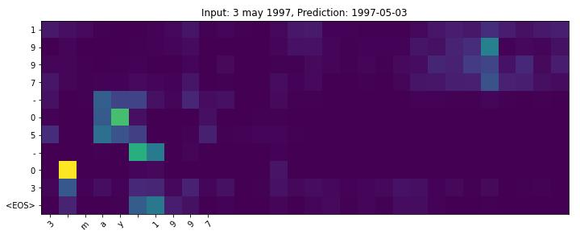

# Paying attention to attention
Presentation and code about basics of the attention mechanism in seq2seq models. 

We present an end-to-end trained solution for translating date information typed by a human into a date format recognizable for a computer. Tmplemented solution is using simple attention-based model. We also present a visualization of a trained attention weights.

Example translation below: 




## Code

Jupyter notebook presenting the human-machine date translation using attention-based model  can be found [here](https://github.com/tugot17/paying-attention-to-attention/blob/master/Paying_attention_to_Attention.pdf)

You can run this code in google colab by clicking this [link](https://colab.research.google.com/github/tugot17/Paying-Attention-to-Attention/blob/master/human_machine_translation.ipynb), but remeber to first download required data. You can do it by running the following command in the colab env.

```
!wget https://raw.githubusercontent.com/tugot17/Paying-Attention-to-Attention/master/human-machine.csv
```


## Presentation

Compiled version of presentation can be found [here](https://github.com/tugot17/paying-attention-to-attention/blob/master/Paying_attention_to_Attention.pdf)

Presentation Latex code can be found in [presentation_code folder](https://github.com/tugot17/paying-attention-to-attention/tree/master/presentation_code)


## Credits

[Presentation](https://github.com/tugot17/paying-attention-to-attention/blob/master/Paying_attention_to_Attention.pdf) contains references to all images and papers used within it. 

The following data sources and articles were used to create the helper [notebook](https://github.com/tugot17/paying-attention-to-attention/blob/master/human_machine_translation.ipynb)

### Data 

Human-machine dataset was taken from [this repository](https://github.com/mzbac/human-to-machine-date-translation/blob/master/human-machine.csv)

### Pytorch official tutorial

The general idea was for seq2seq translation with attention mechanism was inspired by [official pytorch tutorial](https://pytorch.org/tutorials/intermediate/seq2seq_translation_tutorial.html)


## Authors
* [tugot17](https://github.com/tugot17)

## License

This project is licensed under the MIT License - see the [LICENSE](LICENSE) file for details
